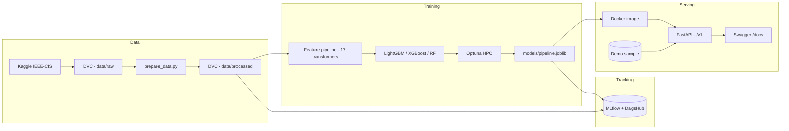

# Fraud Detection ML

End-to-end MLOps pipeline for [IEEE-CIS Fraud Detection](https://www.kaggle.com/competitions/ieee-fraud-detection) (Kaggle 2019): data versioning, feature engineering, experiment tracking, model training and evaluation, and a containerized serving API.

[](https://github.com/alexmatiasas/fraud-detection-ml/actions/workflows/ci.yml)
[](https://www.python.org/)

> **Deployment status**: the serving API is containerized and ready. A public URL will be published here once deployed to Cloud Run.

---

## About

Fraud detection on transactional data is a classic imbalanced-classification problem: only **3.4%** of transactions are fraudulent, so accuracy is meaningless. The project focuses on:

- **Reproducible data science** — DVC for data/artifact versioning, MLflow + DagsHub for experiment tracking and model registry.
- **EDA-driven feature engineering** — a 341-feature space built from 17 purpose-built transformers, each documented and tested.
- **Production-ready serving** — a versioned FastAPI service with rate limiting, API-key auth for model management, structured JSON logs, and a multi-stage Docker image running as a non-root user.

The project is written to portfolio standards: every decision is documented (`configs/*.yaml`, notebooks, model card), and the suite of **344 tests** covers transformers, training, evaluation, and API behavior.

## Current model
<!-- TODO: Check current model used at the very end, it may be various models deployed for comparison -->
The served model is an **XGBoost** classifier evaluated on a temporal hold-out (test set is the last 20% of the transaction timeline, no shuffle).

| Metric | Value |
|---|---|
| ROC AUC | **0.9145** |
| Average Precision | **0.5484** (95% CI [0.5318, 0.5650]) |
| F1 @ optimal threshold (0.65) | 0.5406 |
| Precision / Recall | 0.4693 / 0.5689 |
| Brier score | 0.0322 |
| Expected cost / transaction | 0.1619 @ thr 0.32 |
| Recall@top 1% / 5% | 0.2571 / 0.6021 |

The full model card with top features and evaluation settings is at `models/model_card.md`.

## Architecture



## Feature engineering

All feature decisions come from the [EDA in R](notebooks/01_eda_r/01_EDA_in_R.Rmd). Highlights:

- **Time features** — cyclic encoding of hour, day of week; D1–D15 timedelta columns kept only where they carry signal (D6–D9, D12–D14 dropped at 87–94% missing).
- **Identity signals** — `has_identity` binary flag; the ~76% structurally-missing identity block is treated explicitly.
- **Categorical encoding** — product/card/email-domain categories with ordinal and frequency encodings, plus a transactional `card1` frequency feature.
- **V-feature curation** — 0.01 variance filter + 0.95 correlation filter (see `configs/features.yaml`).
- **Missing-value convention** — numerical missing → `-999` (LightGBM sentinel), categorical missing → `"missing"`, M flags → `{T:1, F:0, NaN:-1}`.
- **Class imbalance** — `scale_pos_weight = 27.6`; the decision threshold is tuned on F1, and evaluation uses **Average Precision**, never accuracy.

## Tech stack

| Layer | Technology |
|---|---|
| Data versioning | DVC + DagsHub storage |
| Experiment tracking / registry | MLflow + DagsHub |
| Feature pipeline | scikit-learn Pipeline + pandas |
| Training | LightGBM / XGBoost / RandomForest |
| HPO | Optuna |
| Serving API | FastAPI + uvicorn + slowapi |
| Container | Docker (multi-stage, non-root) |
| CI | GitHub Actions (ruff, basedpyright, pytest) |
| EDA | R 4.4 · tidyverse · arrow |
| Testing | pytest + hypothesis |

## Repository structure

```
configs/                  # data/features/train/evaluate/mlflow YAML + schemas
data/                     # raw + processed parquet (DVC, not in git)
models/                   # pipeline.joblib, report.json, model card, plots
notebooks/                # R EDA + Quarto FE/training verification
scripts/                  # download_data, prepare_data, generate_sample
src/fdml/features/        # 17 feature transformers + pipeline factory
src/fdml/models/          # train (LGBM/XGB/RF), evaluate (metrics/plots/...)
src/fdml/api/             # FastAPI app: routers, schemas, model loader, limiter
tests/                    # 344 unit + integration tests
```

## Getting started

Requires [uv](https://docs.astral.sh/uv/) and Python 3.11.

```bash
make install              # creates the environment (dev + train + api extras)
```

### Data

```bash
make data-download        # needs a Kaggle API key (~1.1M transactions)
make data-convert         # CSV -> optimized Parquet
```

### Train and evaluate

```bash
make train ARGS="model.name=xgboost"   # or lightgbm / random_forest
make evaluate                          # metrics, plots, report.json, model card
make sample                            # builds data/samples for the API demo
```

Run the full DVC pipeline instead:

```bash
dvc repro
```

### Run the API locally

```bash
make serve-dev                        # uvicorn with reload on :8000
```

Interactive docs at http://localhost:8000/docs.

## API

All routes are under `/v1`. Predictions are scored by `TransactionID` against a labeled demo sample so the raw row is available and the full feature pipeline runs server-side.

| Method | Path | Description | Auth |
|---|---|---|---|
| `GET` | `/v1/health` | Liveness probe | — |
| `GET` | `/v1/ready` | Readiness probe (model loaded) | — |
| `POST` | `/v1/predict` | Score one transaction | — |
| `POST` | `/v1/predict/batch` | Score up to 50 transactions | — |
| `GET` | `/v1/model/info` | Served model + metrics | — |
| `PUT` | `/v1/model/reload` | Reload from source | `X-API-Key` |
| `PUT` | `/v1/model/switch` | Hot-swap registry version | `X-API-Key` |
| `GET` | `/v1/models` | List registry versions | — |
| `GET` | `/v1/metrics` | Offline evaluation metrics | — |

```bash
curl -X POST http://localhost:8000/v1/predict \
  -H "Content-Type: application/json" \
  -d '{"transaction_id": 123456}'
```

```json
{
  "transaction_id": 123456,
  "is_fraud": false,
  "probability": 0.0123,
  "threshold": 0.6534,
  "model_version": null,
  "raw": { "TransactionAmt": 5000.0, "...": "..." }
}
```

### Docker

```bash
make docker-build         # multi-stage image, API-only dependency set
make docker-run           # needs DAGSHUB_* / FDML_API_KEY via .env
```

The image ships only the serving API: training-only packages (xgboost, dvc, optuna, ...) are excluded from the build. The `uv` layer uses cache mounts so dependency downloads persist across rebuilds.

### Environment variables

| Variable | Purpose |
|---|---|
| `DAGSHUB_USERNAME` / `DAGSHUB_TOKEN` / `DAGSHUB_REPO` | MLflow remote tracking/registry (or `.env`) |
| `FDML_API_KEY` | Guards `/v1/model/*` mutating endpoints |

## Notebooks

- [EDA in R](notebooks/01_eda_r/01_EDA_in_R.Rmd) — full dataset exploration that drives every feature decision.
- [Feature engineering verification](notebooks/02_feature_engineering/02_feature_engineering.qmd) — proves each transformer output against `configs/features.yaml`.
- [Training verification](notebooks/03_training/03_training_verification.qmd) — temporal split, MLflow tracking, registry, benchmarks.

## Roadmap

- **Ensemble models** — weighted-average and stacking of LightGBM + XGBoost + RandomForest, with blend weights logged to MLflow.
- **Model registry** — register all trained models (LightGBM/XGBoost/RF) with `champion`/`challenger` aliases based on Average Precision.
- **Deployment** — build and push the image from CI (GitHub Actions) to Cloud Run.
- **Fairness analysis** — segment-level metrics across card brand, email domain, and device type.

## Contact

- Repository: [github.com/alexmatiasas/fraud-detection-ml](https://github.com/alexmatiasas/fraud-detection-ml)
- Personal site: [alexmatias.vercel.app](https://alexmatias.vercel.app)
